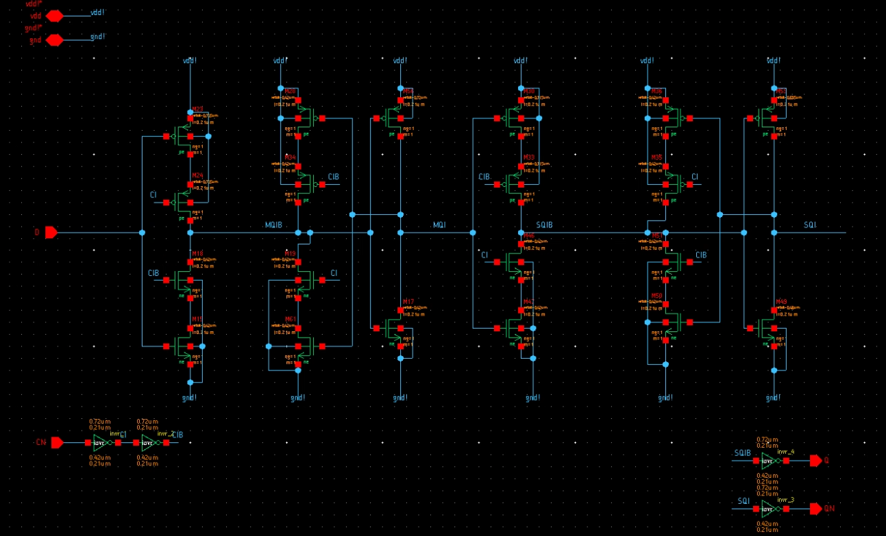
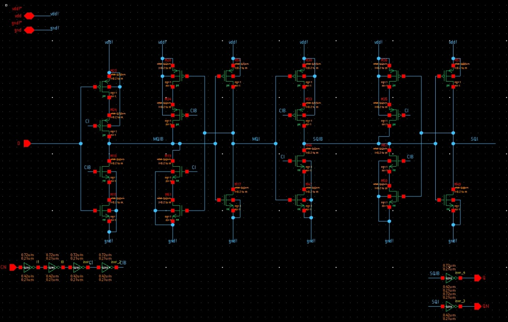
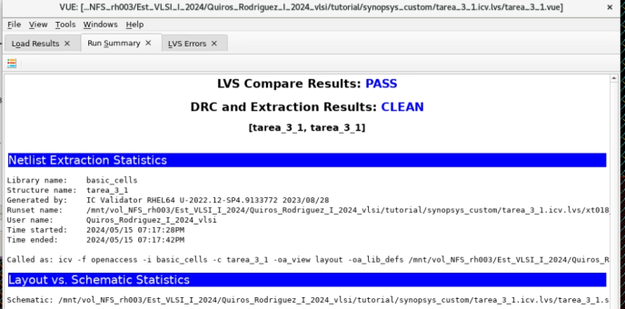
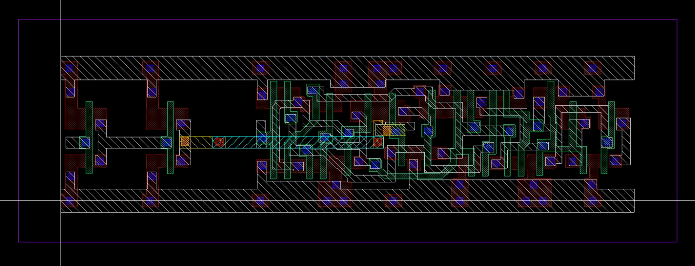
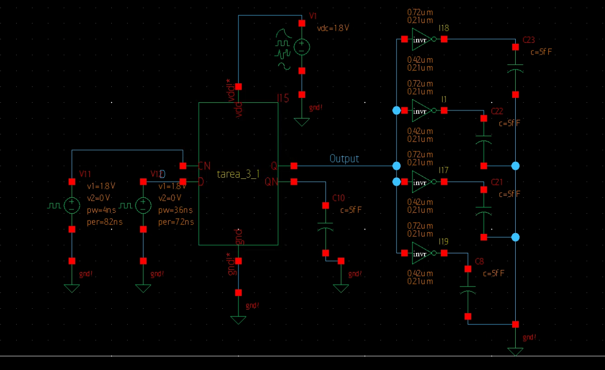
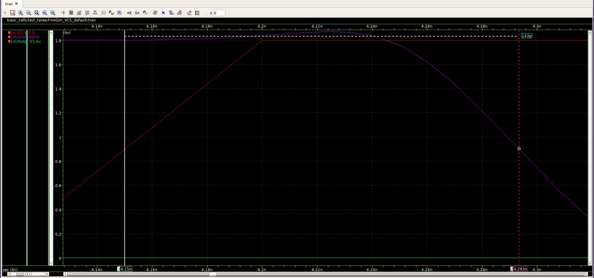
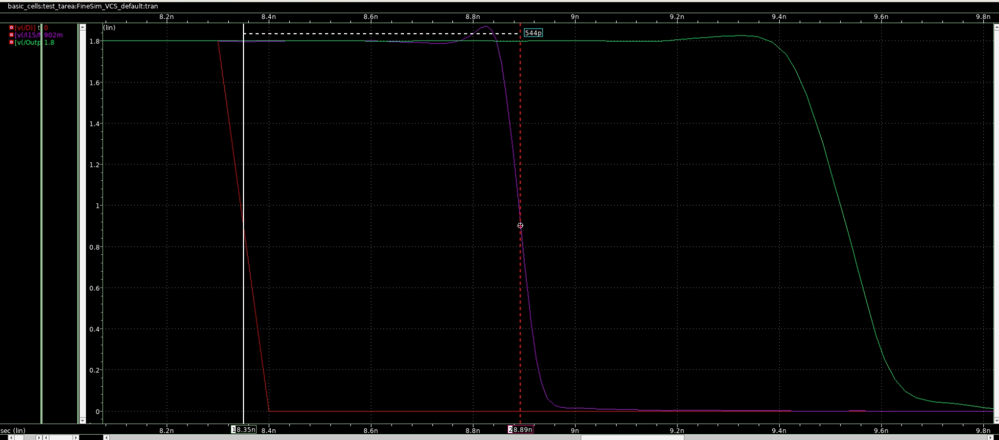
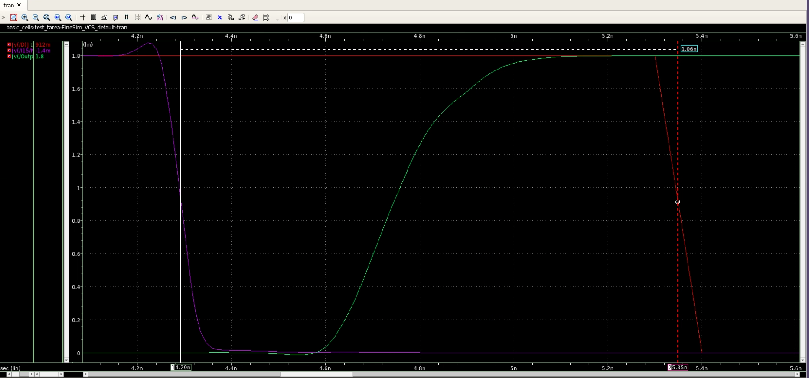
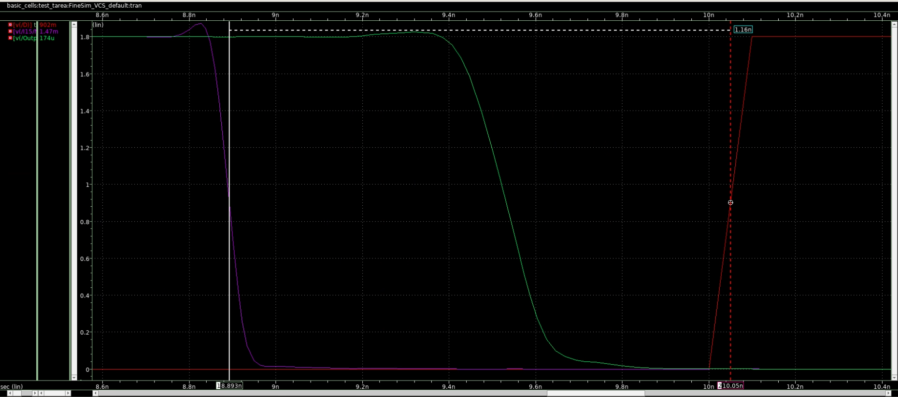
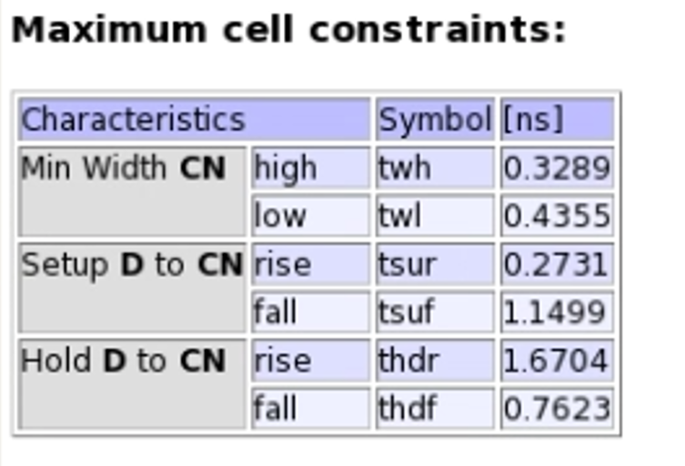

# Tarea 3 - Caracterización de Flip Flop Estático Amo-Esclavo
Esteicy Jazmín Faerron Durán - Andrew José Quirós Rodríguez

## Introducción

En esta tarea se plantea caracterizar un Flip Flop estático Amo-Esclavo. Para esto se utiliza un Flip Flop predeterminado que brinda la herramienta de trabajo (a este se le denomina "Flip Flop original" a lo largo del documento) A este mismo se le hacen algunas modificaciones agregando inversores. A este que se modifica es al que se caracteriza obteniendo su tsetup y su thold y se comparan los resultados de los tiempos de simulación con los que brinda el Flip Flop original en la herramienta (a los cuales se le denominan tiempos teóricos en este documento).

## Esquemático

Como punto de comparación se muestra el esquemático del Flip Flop original.

A continuación se muestra el esquemático del Flip Flop más los inversores añadidos.

## Layout

Con el esquemático listo, se procede a realizar el layout. Esto, mediante el layout del Flip Flop que incluye la herramienta en unión con los inversores que se añadieron. También se prueba que pase sin errores todas las verificaciones.

## Esquemático de pruebas

Para las mediciones de los tiempos se requiere un FO4 en la salida del circuito, como se muestra en el siguiente esquemático, el circuito completo para simular las señales.

## Tiempos

### tsetup

El tiempo de setup se mide en el momento en el que la entrada es válida antes que cambie la señal de reloj, por ejemplo, para el caso del levantamiento como se muestra en la siguiente figura la señal de reloj con color morado y la señal de entrada de color rojo, y justo cuando la señal de reloj va a transicionar, ya la señal de entrada está en su punto máximo de levantamiento, es decir, ya es válida, por lo que el tiempo se puede medir en ese momento. Tal y como se observa en los marcadores del gráfico, el tiempo de setup es de 143ps.

En el caso de caída, aplica lo mismo, la señal debe ser válida antes de que el reloj haga una transición, en este caso, el resultado es de 544ps.

### thold

El tiempo de thold, es más bien cuando la señal continúa siendo válida después de que el reloj haya hecho su transición, como se puede observar en la siguiente figura, el tiempo que la señal puede mantenerse válida en 1 es de 1.06ns para el levantamiento.

Por otro lado, en el caso de caída el tiempo de thold es de 1.16ns como se observa en la siguiente figura.

## Comparación de los tiempos

Los resultados que se obtuvieron se comparan con los valores del diseño original. Los tiempos del flip flop original se muestra en la siguiente figura.

 

Y ahora se realizan las tablas comparativas, primero para el tsetup y después para el thold.

|   |tsetup teórico(ns)|tsetup simulado(ns)|
|---|----------|--|
|rise|0.2731|0.143|
|fall|1.1499|0.544|
 

|   |thold teórico(ns)|thold simulado(ns)|
|---|----------|--|
|rise|1.6704|1.06|
|fall|0.7623|1.16|

Como se puede observar en los resultados de la comparación, el tsetup simulado con los inversores es casi la mitad del valor del tsetup que brinda la herramienta con su diseño original, tanto para el rise como para el fall. Por otro lado, el thold en el caso del rise sí disminuye un poco, pero en el caso del fall aumenta. 

Se puede decir que sí son valores alejados en general, tanto para el tsetup como para el thold, el haber agregado los inversores causa una gran diferencia.